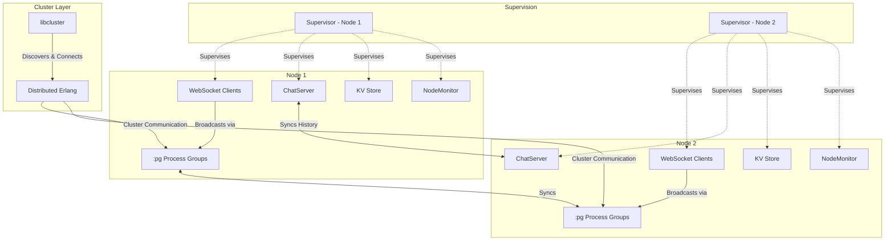
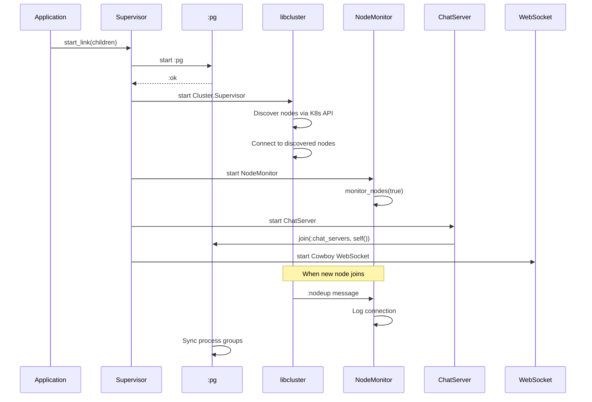
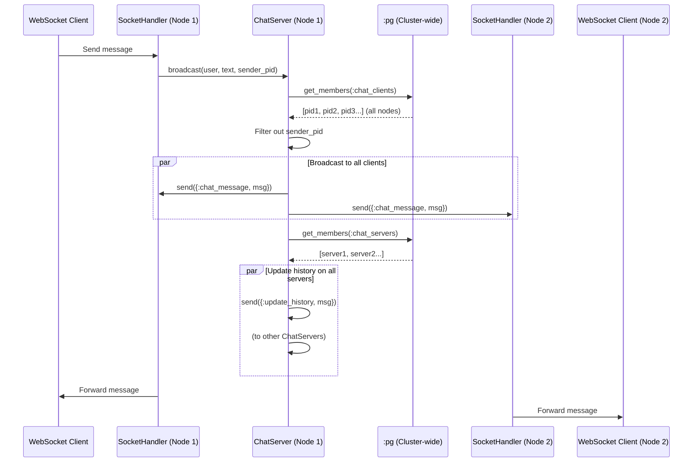
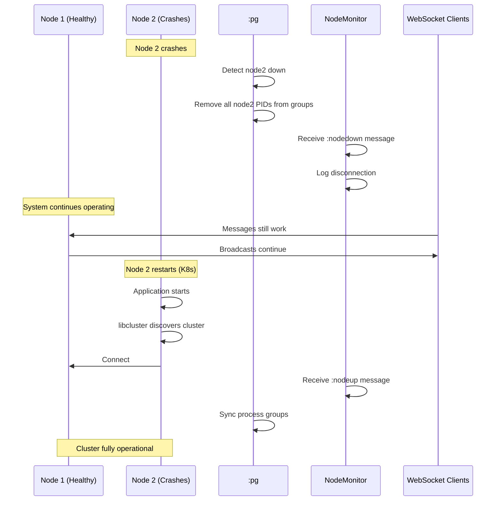

# Fault-Tolerant Distributed Architecture

This document explains how WebSockets, Supervisor, libcluster, and `:pg` (process groups) work together to create a fault-tolerant distributed chat system in Elixir.

## Table of Contents

1. [Architecture Overview](#architecture-overview)
2. [Component Breakdown](#component-breakdown)
3. [How They Work Together](#how-they-work-together)
4. [Fault Tolerance Mechanisms](#fault-tolerance-mechanisms)
5. [Message Flow](#message-flow)
6. [Failure Scenarios and Recovery](#failure-scenarios-and-recovery)

---

## Architecture Overview

The system consists of multiple Elixir nodes running in a Kubernetes cluster, forming a distributed fault-tolerant chat application. Here's how the key components interact:



---

## Component Breakdown

### 1. **Supervisor** - Process Supervision Tree

**Location**: [`application.ex`](file:///Users/linh/Projects/webserver/lib/webserver/application.ex)

The Supervisor is the foundation of fault tolerance in Elixir. It monitors child processes and restarts them if they crash.

```elixir
children = [
  %{id: :pg, start: {:pg, :start_link, []}},
  {Cluster.Supervisor, [Application.get_env(:libcluster, :topologies, [])]},
  Webserver.NodeMonitor,
  Webserver.KV,
  Webserver.ChatServer,
  {Plug.Cowboy, scheme: :http, plug: Webserver.Router, options: [port: 4000, dispatch: dispatch]}
]

opts = [strategy: :one_for_one, name: Webserver.Supervisor]
Supervisor.start_link(children, opts)
```

**Key Points**:
- **Strategy**: `:one_for_one` - if a child crashes, only that child is restarted
- **Supervision Order**: Children start in order, ensuring dependencies are ready
- **Automatic Recovery**: Crashed processes are automatically restarted

### 2. **libcluster** - Automatic Node Discovery

**Purpose**: Automatically discovers and connects Elixir nodes in a Kubernetes cluster.

**How it works**:
1. Uses Kubernetes API to discover pods with matching labels
2. Establishes distributed Erlang connections between nodes
3. Monitors cluster membership and handles node joins/leaves
4. Provides a unified cluster view across all nodes

**Configuration** (typically in `config/runtime.exs` or `config/prod.exs`):
```elixir
config :libcluster,
  topologies: [
    k8s: [
      strategy: Cluster.Strategy.Kubernetes,
      config: [
        mode: :dns,
        kubernetes_node_basename: "webserver",
        kubernetes_selector: "app=webserver",
        polling_interval: 10_000
      ]
    ]
  ]
```

### 3. **`:pg` (Process Groups)** - Distributed Process Registry

**Purpose**: A distributed process group registry that works across the entire cluster.

**Key Features**:
- **Cluster-wide**: Process groups are automatically synchronized across all connected nodes
- **Fault-tolerant**: If a process dies, it's automatically removed from all groups
- **No single point of failure**: Each node maintains its own view, synchronized via gossip protocol

**Usage in the system**:

```elixir
# Join a process group (in ChatServer)
:pg.join(:chat_servers, self())

# Join a process group (in SocketHandler)
:pg.join(:chat_clients, self())

# Get all members across the cluster
:pg.get_members(:chat_clients)  # Returns PIDs from ALL nodes
:pg.get_members(:chat_servers)  # Returns PIDs from ALL nodes
```

### 4. **WebSocket Handler** - Client Connection Management

**Location**: [`socket_handler.ex`](file:///Users/linh/Projects/webserver/lib/webserver/socket_handler.ex)

Manages individual WebSocket connections using Cowboy's WebSocket behavior.

**Lifecycle**:
1. **`init/2`**: Parse connection parameters (username)
2. **`websocket_init/1`**: Join `:chat_clients` group, send chat history
3. **`websocket_handle/2`**: Handle incoming messages from client
4. **`websocket_info/2`**: Handle messages from other processes (broadcasts)

### 5. **ChatServer** - Message Broadcasting & History

**Location**: [`chat_server.ex`](file:///Users/linh/Projects/webserver/lib/webserver/chat_server.ex)

A GenServer that manages chat message broadcasting and history across the cluster.

**Key Responsibilities**:
- Broadcast messages to all connected clients (cluster-wide)
- Maintain in-memory chat history (last 50 messages)
- Synchronize history across all ChatServer instances

### 6. **NodeMonitor** - Cluster Monitoring

**Location**: [`node_monitor.ex`](file:///Users/linh/Projects/webserver/lib/webserver/node_monitor.ex)

A GenServer that monitors node connections and disconnections.

**How it works**:
```elixir
:net_kernel.monitor_nodes(true)
```

This subscribes to `:nodeup` and `:nodedown` messages from the Erlang VM.

---

## How They Work Together

### Startup Sequence



### Message Broadcasting Flow

When a user sends a chat message, here's what happens:



**Key Points**:
1. **`:pg.get_members(:chat_clients)`** returns PIDs from **all nodes** in the cluster
2. Messages are sent directly to processes on other nodes (transparent distribution)
3. Each ChatServer maintains its own history, synchronized via messages
4. No central coordinator - fully distributed

---

## Fault Tolerance Mechanisms

### 1. **Process-Level Fault Tolerance**

**Supervisor Restart Strategy**:
- If `ChatServer` crashes → Supervisor restarts it
- If `NodeMonitor` crashes → Supervisor restarts it
- If a WebSocket connection crashes → Only that connection is affected

**Example**: If `ChatServer` crashes:
```
1. Supervisor detects crash
2. Supervisor starts new ChatServer process
3. New ChatServer joins :chat_servers group via :pg
4. Chat history is lost (in-memory), but system continues
5. New messages work immediately
```

### 2. **Node-Level Fault Tolerance**

**What happens when a node crashes**:



**Automatic Recovery**:
1. **Kubernetes** detects pod failure and restarts it
2. **libcluster** discovers the new pod and connects it
3. **`:pg`** automatically syncs process groups
4. **ChatServer** on new node joins `:chat_servers` group
5. New WebSocket clients can connect immediately

### 3. **Network Partition Handling**

**Scenario**: Network split separates nodes

```
Before partition:
[Node1, Node2, Node3] - Single cluster

During partition:
[Node1, Node2] | [Node3] - Two separate clusters

After partition heals:
[Node1, Node2, Node3] - Merged cluster
```

**What happens**:
- Each partition operates independently
- `:pg` groups are separate in each partition
- Chat messages only broadcast within partition
- When partition heals, `:pg` automatically merges groups
- No data loss for messages sent during partition (each partition has its own history)

### 4. **Client Connection Fault Tolerance**

**WebSocket Connection Failures**:
- If client disconnects → Process exits, automatically removed from `:chat_clients` group
- If client reconnects → New process joins group, receives full history
- No impact on other clients or the cluster

---

## Message Flow

### 1. **New Client Connects**

```elixir
# socket_handler.ex
def websocket_init(state) do
  # Join the chat clients group to receive broadcasts
  :pg.join(:chat_clients, self())
  
  # Send history to the new user
  history = Webserver.ChatServer.get_history()
  
  Enum.each(history, fn msg ->
    json = Jason.encode!(msg)
    send(self(), {:text, json})
  end)
  
  {:ok, state}
end
```

**Flow**:
1. Client connects via WebSocket
2. Process joins `:chat_clients` group (visible cluster-wide)
3. Fetches history from local `ChatServer`
4. Sends history to client
5. Ready to receive broadcasts

### 2. **Broadcasting Messages**

```elixir
# chat_server.ex
def broadcast(user, text, sender_pid) do
  message = %{
    user: user,
    text: text,
    timestamp: DateTime.utc_now() |> DateTime.to_string()
  }
  
  # Broadcast directly to all clients in the cluster (except sender)
  :pg.get_members(:chat_clients)
  |> Enum.reject(fn pid -> pid == sender_pid end)
  |> Enum.each(fn pid -> send(pid, {:chat_message, message}) end)
  
  # Also update history on all chat servers
  :pg.get_members(:chat_servers)
  |> Enum.each(fn pid -> send(pid, {:update_history, message}) end)
end
```

**Key Insight**: `:pg.get_members/1` returns PIDs from **all nodes**, enabling transparent cluster-wide broadcasting.

### 3. **History Synchronization**

```elixir
# chat_server.ex
def handle_info({:update_history, message}, history) do
  new_history = [message | history] |> Enum.take(@history_limit)
  {:noreply, new_history}
end
```

**Strategy**:
- Each `ChatServer` maintains its own history
- All servers receive `:update_history` messages
- Eventually consistent (all servers converge to same history)
- If a server crashes, it loses history but rebuilds from new messages

---

## Failure Scenarios and Recovery

### Scenario 1: ChatServer Crashes

**Problem**: ChatServer process crashes on Node 1

**Recovery**:
1. Supervisor detects crash immediately
2. Supervisor restarts ChatServer
3. New ChatServer joins `:chat_servers` group
4. History is lost (in-memory state)
5. New messages populate history going forward

**Impact**:
- ✅ No downtime for message broadcasting
- ✅ Clients on other nodes unaffected
- ❌ Chat history lost on Node 1
- ✅ Other nodes still have history

**Improvement**: Use persistent storage (ETS, Mnesia, or external DB) for history.

### Scenario 2: Entire Node Crashes

**Problem**: Node 2 crashes completely

**Recovery**:
1. `:pg` detects node down, removes all Node 2 PIDs
2. `NodeMonitor` on other nodes logs `:nodedown`
3. Kubernetes restarts Node 2 pod
4. libcluster discovers and connects new pod
5. New processes join `:pg` groups
6. System fully operational

**Impact**:
- ✅ Clients on Node 1 and Node 3 unaffected
- ❌ Clients on Node 2 disconnected (must reconnect)
- ✅ Reconnected clients get full history from any node
- ✅ No message loss for clients on healthy nodes

### Scenario 3: Network Partition

**Problem**: Network split between Node 1 and Node 2

**During Partition**:
- Two separate clusters: `[Node 1]` and `[Node 2]`
- Each cluster operates independently
- Messages only broadcast within partition
- Each partition has separate history

**After Partition Heals**:
- Nodes reconnect automatically (libcluster)
- `:pg` groups merge
- Both histories exist separately (no automatic merge)
- New messages broadcast to all nodes

**Impact**:
- ✅ No downtime during partition
- ❌ History divergence (split-brain scenario)
- ✅ Automatic reconnection when network heals
- ⚠️ Manual reconciliation may be needed for history

**Improvement**: Implement conflict resolution or use distributed consensus (e.g., Raft, Paxos).

### Scenario 4: WebSocket Client Disconnects

**Problem**: Client loses internet connection

**Recovery**:
1. WebSocket process exits
2. Process automatically removed from `:chat_clients` group
3. Client reconnects (new WebSocket connection)
4. New process joins `:chat_clients` group
5. Client receives full history

**Impact**:
- ✅ No impact on other clients
- ✅ Automatic cleanup (no zombie processes)
- ✅ Seamless reconnection experience

---

## Why This Architecture is Fault-Tolerant

### 1. **No Single Point of Failure**

- **Multiple nodes**: If one node fails, others continue
- **Distributed `:pg`**: Process groups synced across all nodes
- **Local history**: Each ChatServer has history (redundancy)

### 2. **Automatic Recovery**

- **Supervisor**: Restarts crashed processes
- **libcluster**: Reconnects nodes automatically
- **`:pg`**: Self-healing process groups

### 3. **Transparent Distribution**

- **Location transparency**: Send messages to PIDs regardless of node
- **Cluster-wide broadcasting**: `:pg.get_members/1` returns all PIDs
- **No manual node management**: libcluster handles discovery

### 4. **Graceful Degradation**

- **Partial failures**: System continues with reduced capacity
- **Client isolation**: One client crash doesn't affect others
- **Node isolation**: One node crash doesn't affect other nodes

---

## Note on GenStage

**Important**: This codebase does **not** currently use GenStage. GenStage is a behavior for building producer-consumer pipelines with back-pressure. It would be useful for:

- **Rate limiting**: Control message flow to prevent overwhelming clients
- **Message buffering**: Queue messages during high load
- **Back-pressure**: Slow down producers when consumers can't keep up

**Current architecture** uses:
- **GenServer**: For stateful processes (ChatServer, NodeMonitor)
- **Agent**: For simple state (KV store)
- **Direct message passing**: For broadcasting (via `:pg`)

**When to add GenStage**:
- High message volume requiring back-pressure
- Complex message processing pipelines
- Need for buffering and flow control

---

## Summary

This distributed chat system achieves fault tolerance through:

1. **Supervisor**: Automatic process restart on failure
2. **libcluster**: Automatic node discovery and connection
3. **`:pg`**: Distributed, self-healing process groups
4. **WebSockets**: Stateful client connections with automatic cleanup
5. **Distributed Erlang**: Transparent inter-node communication

The system can survive:
- ✅ Individual process crashes
- ✅ Entire node failures
- ✅ Network partitions (with caveats)
- ✅ Client disconnections

**Trade-offs**:
- In-memory history is lost on ChatServer crash
- Network partitions can cause history divergence
- No built-in conflict resolution

**Potential Improvements**:
- Add persistent storage for chat history
- Implement GenStage for back-pressure
- Add distributed consensus for partition handling
- Use CRDTs for conflict-free history merging
