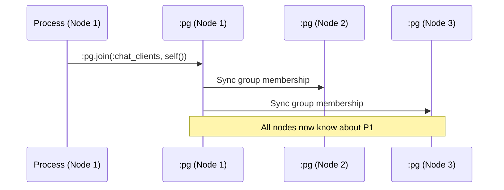
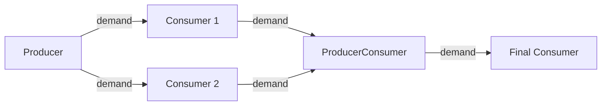

# GenStage vs :pg vs Node.spawn_link/2

This document explains the differences between GenStage, `:pg` (process groups), and `Node.spawn_link/2`, and analyzes whether GenStage can replace `:pg` in our distributed chat application.

## Table of Contents

1. [Quick Comparison](#quick-comparison)
2. [Deep Dive: :pg (Process Groups)](#deep-dive-pg-process-groups)
3. [Deep Dive: GenStage](#deep-dive-genstage)
4. [Deep Dive: Node.spawn_link/2](#deep-dive-nodespawn_link2)
5. [Can GenStage Replace :pg?](#can-genstage-replace-pg)
6. [Use Cases and Recommendations](#use-cases-and-recommendations)

---

## Quick Comparison

| Feature | `:pg` | GenStage | `Node.spawn_link/2` |
|---------|-------|----------|---------------------|
| **Purpose** | Distributed process registry | Producer-consumer pipeline with back-pressure | Spawn process on remote node |
| **Distribution** | Automatic cluster-wide | Manual (you handle distribution) | Explicit remote execution |
| **Use Case** | Pub/sub, process discovery | Data processing pipelines | Remote task execution |
| **Back-pressure** | ❌ No | ✅ Yes | ❌ No |
| **Automatic Sync** | ✅ Yes (across cluster) | ❌ No | ❌ No |
| **Fault Tolerance** | ✅ Auto-cleanup on process death | ⚠️ Manual supervision needed | ⚠️ Manual supervision needed |
| **Message Pattern** | Broadcast (1-to-many) | Pipeline (producer → consumer) | Direct (1-to-1) |
| **Complexity** | Low | Medium-High | Low |
| **Learning Curve** | Easy | Steep | Easy |

---

## Deep Dive: :pg (Process Groups)

### What is :pg?

`:pg` is Erlang's built-in **distributed process group** system. It allows you to:
- Group processes under a name (e.g., `:chat_clients`)
- Automatically synchronize groups across all connected nodes
- Query all processes in a group, regardless of which node they're on

### How :pg Works

```elixir
# Node 1: Join a group
:pg.join(:chat_clients, self())

# Node 2: Get all members (returns PIDs from ALL nodes)
members = :pg.get_members(:chat_clients)
# => [#PID<0.123.0>, #PID<10234.456.0>, #PID<10235.789.0>]
#     ^Node 1       ^Node 2             ^Node 3

# Broadcast to all members
Enum.each(members, fn pid ->
  send(pid, {:message, "Hello!"})
end)
```

### Key Features

#### 1. **Automatic Cluster-Wide Synchronization**

When a process joins a group, `:pg` automatically propagates this information to all connected nodes.



#### 2. **Automatic Cleanup**

If a process dies, `:pg` automatically removes it from all groups on all nodes.

```elixir
# Process joins group
:pg.join(:chat_clients, pid)

# Process crashes
Process.exit(pid, :kill)

# :pg automatically removes it from the group
:pg.get_members(:chat_clients)  # pid is gone
```

#### 3. **Location Transparency**

You don't need to know which node a process is on. Just get all members and send messages.

```elixir
# Works regardless of node location
:pg.get_members(:chat_clients)
|> Enum.each(fn pid -> send(pid, {:broadcast, msg}) end)
```

### :pg in Our Chat Application

```elixir
# socket_handler.ex - Client joins group
def websocket_init(state) do
  :pg.join(:chat_clients, self())
  {:ok, state}
end

# chat_server.ex - Broadcast to all clients
def broadcast(user, text, sender_pid) do
  :pg.get_members(:chat_clients)
  |> Enum.reject(fn pid -> pid == sender_pid end)
  |> Enum.each(fn pid -> send(pid, {:chat_message, message}) end)
end
```

**Why this works**:
- `:pg.get_members(:chat_clients)` returns PIDs from **all nodes**
- Sending to a remote PID is transparent (Distributed Erlang handles it)
- No manual node management needed

---

## Deep Dive: GenStage

### What is GenStage?

GenStage is a **specification for producer-consumer pipelines** with built-in **back-pressure**. It's designed for processing streams of data where consumers control the flow rate.

### Core Concepts



#### 1. **Producer**
Generates events/data. Only sends data when consumers request it (demand).

```elixir
defmodule MyProducer do
  use GenStage

  def start_link(initial) do
    GenStage.start_link(__MODULE__, initial, name: __MODULE__)
  end

  def init(counter) do
    {:producer, counter}
  end

  def handle_demand(demand, counter) when demand > 0 do
    # Generate events based on demand
    events = Enum.to_list(counter..counter+demand-1)
    {:noreply, events, counter + demand}
  end
end
```

#### 2. **Consumer**
Receives events and processes them. Controls flow by requesting specific demand.

```elixir
defmodule MyConsumer do
  use GenStage

  def start_link() do
    GenStage.start_link(__MODULE__, :ok)
  end

  def init(:ok) do
    {:consumer, :ok}
  end

  def handle_events(events, _from, state) do
    # Process events
    Enum.each(events, fn event ->
      IO.inspect(event, label: "Consumed")
    end)
    {:noreply, [], state}
  end
end
```

#### 3. **ProducerConsumer**
Both consumes from upstream and produces for downstream.

```elixir
defmodule MyProducerConsumer do
  use GenStage

  def init(:ok) do
    {:producer_consumer, :ok}
  end

  def handle_events(events, _from, state) do
    # Transform events
    transformed = Enum.map(events, &(&1 * 2))
    {:noreply, transformed, state}
  end
end
```

### Subscribing Consumers to Producers

```elixir
# Start the pipeline
{:ok, producer} = MyProducer.start_link(0)
{:ok, consumer1} = MyConsumer.start_link()
{:ok, consumer2} = MyConsumer.start_link()

# Subscribe consumers to producer
GenStage.sync_subscribe(consumer1, to: producer, max_demand: 10)
GenStage.sync_subscribe(consumer2, to: producer, max_demand: 5)
```

### Key Features

#### 1. **Back-Pressure**

Consumers control the rate of data flow by requesting specific demand.

```elixir
# Consumer requests 10 events
{:consumer, :ok, subscribe_to: [{producer, max_demand: 10, min_demand: 5}]}

# Producer only sends when demand exists
def handle_demand(demand, state) do
  # Only produce 'demand' number of events
  {:noreply, events, state}
end
```

#### 2. **Buffering**

GenStage can buffer events when consumers are slow.

```elixir
{:producer, state, buffer_size: 10_000}
```

#### 3. **Partitioning**

Distribute events across multiple consumers using a dispatcher.

```elixir
# Producer with partition dispatcher
def init(state) do
  {:producer, state, dispatcher: GenStage.PartitionDispatcher}
end

# Consumer subscribes to specific partition
GenStage.sync_subscribe(consumer, to: producer, partition: 0)
```

### GenStage is NOT for Pub/Sub

**Important**: GenStage is **not designed** for pub/sub patterns like chat broadcasting.

**Why?**
- GenStage is for **pipelines**, not **broadcasting**
- Consumers **pull** data (demand-driven), not **push**
- Events flow in **one direction** (producer → consumer)
- No built-in cluster-wide synchronization

---

## Deep Dive: Node.spawn_link/2

### What is Node.spawn_link/2?

`Node.spawn_link/2` spawns a process on a **specific remote node** and links it to the caller.

### How It Works

```elixir
# Spawn a process on a remote node
pid = Node.spawn_link(:"node2@hostname", fn ->
  IO.puts("Running on #{Node.self()}")
  receive do
    {:msg, text} -> IO.puts(text)
  end
end)

# Send message to remote process
send(pid, {:msg, "Hello from remote!"})
```

### Key Features

#### 1. **Explicit Node Selection**

You choose exactly which node to spawn on.

```elixir
# Get list of nodes
nodes = Node.list()

# Spawn on first node
pid = Node.spawn_link(Enum.at(nodes, 0), fn ->
  # This runs on the remote node
  do_work()
end)
```

#### 2. **Linked Process**

If the spawned process crashes, the caller is notified (and may crash too).

```elixir
# Spawn and link
pid = Node.spawn_link(node, fn ->
  raise "Oops!"
end)

# Caller receives exit signal
# If not trapping exits, caller crashes too
```

#### 3. **Remote Execution**

Execute code on a specific node without manually managing connections.

```elixir
# Run a function on each node
Node.list()
|> Enum.each(fn node ->
  Node.spawn_link(node, fn ->
    # This runs on each node
    Logger.info("Task running on #{Node.self()}")
  end)
end)
```

### Use Cases

- **Distributed task execution**: Run tasks on specific nodes
- **Load balancing**: Distribute work across nodes
- **Node-specific operations**: Execute code that must run on a particular node

### Limitations

- **Manual node management**: You must track which nodes exist
- **No automatic discovery**: You need to know node names
- **No group semantics**: No built-in way to broadcast to all processes
- **No automatic cleanup**: If a node dies, you must handle it manually

---

## Can GenStage Replace :pg?

### Short Answer: **No, GenStage cannot replace :pg for chat broadcasting.**

### Detailed Analysis

#### What :pg Provides for Chat

1. **Cluster-wide process registry**
   - Automatically tracks all WebSocket connections across all nodes
   - No manual node management

2. **Broadcast semantics**
   - Get all members with one call: `:pg.get_members(:chat_clients)`
   - Send to all with simple `Enum.each`

3. **Automatic synchronization**
   - New nodes automatically sync process groups
   - Process deaths automatically cleaned up

4. **Location transparency**
   - Don't care which node a client is on
   - Just send to the PID

#### What GenStage Provides

1. **Producer-consumer pipeline**
   - Events flow from producer to consumer
   - Not designed for broadcasting

2. **Back-pressure**
   - Consumers control rate of data
   - Prevents overwhelming slow consumers

3. **Buffering**
   - Queue events when consumers are slow
   - Useful for high-throughput scenarios

4. **Ordered processing**
   - Events processed in order
   - Good for data pipelines

#### Why GenStage Doesn't Fit Chat

```elixir
# With :pg (current approach) - SIMPLE
:pg.get_members(:chat_clients)
|> Enum.each(fn pid -> send(pid, {:chat_message, msg}) end)

# With GenStage - COMPLEX and WRONG approach
# You would need:
# 1. A producer for each message
# 2. Each WebSocket as a consumer
# 3. Manual subscription management
# 4. Manual cluster coordination
# 5. No built-in broadcasting

# This is NOT what GenStage is designed for!
```

### Conceptual Mismatch

| Requirement | :pg | GenStage |
|-------------|-----|----------|
| Broadcast to all clients | ✅ Perfect fit | ❌ Not designed for this |
| Cluster-wide sync | ✅ Automatic | ❌ Manual |
| Dynamic clients (join/leave) | ✅ Automatic | ⚠️ Manual subscription |
| Back-pressure needed? | ❌ No (chat is push) | ✅ Yes (but not needed) |
| Pipeline processing? | ❌ No | ✅ Yes (but not needed) |

---

## Using GenStage WITH :pg (Not Instead Of)

While GenStage can't replace `:pg`, it can **complement** it for specific use cases.

### Use Case: Rate Limiting Chat Messages

**Problem**: Prevent spam by rate-limiting messages per user.

**Solution**: Use GenStage for rate limiting, `:pg` for broadcasting.

```elixir
defmodule ChatRateLimiter do
  use GenStage

  def start_link(_) do
    GenStage.start_link(__MODULE__, :ok, name: __MODULE__)
  end

  # Producer: Accepts messages and rate-limits them
  def init(:ok) do
    {:producer, {:queue.new(), 0}, dispatcher: GenStage.DemandDispatcher}
  end

  def handle_cast({:new_message, msg}, {queue, pending_demand}) do
    queue = :queue.in(msg, queue)
    dispatch_events(queue, pending_demand, [])
  end

  def handle_demand(incoming_demand, {queue, pending_demand}) do
    dispatch_events(queue, incoming_demand + pending_demand, [])
  end

  defp dispatch_events(queue, 0, events) do
    {:noreply, Enum.reverse(events), {queue, 0}}
  end

  defp dispatch_events(queue, demand, events) do
    case :queue.out(queue) do
      {{:value, event}, queue} ->
        dispatch_events(queue, demand - 1, [event | events])
      {:empty, queue} ->
        {:noreply, Enum.reverse(events), {queue, demand}}
    end
  end
end

defmodule ChatBroadcaster do
  use GenStage

  def start_link(_) do
    GenStage.start_link(__MODULE__, :ok)
  end

  # Consumer: Receives rate-limited messages and broadcasts via :pg
  def init(:ok) do
    {:consumer, :ok, subscribe_to: [ChatRateLimiter]}
  end

  def handle_events(messages, _from, state) do
    Enum.each(messages, fn msg ->
      # Now broadcast via :pg
      :pg.get_members(:chat_clients)
      |> Enum.each(fn pid -> send(pid, {:chat_message, msg}) end)
    end)
    {:noreply, [], state}
  end
end
```

**Benefits**:
- GenStage provides rate limiting and buffering
- `:pg` provides cluster-wide broadcasting
- Best of both worlds

### Use Case: Message Processing Pipeline

**Problem**: Process messages before broadcasting (e.g., spam filtering, translation).


```elixir
# Producer: Receives raw messages
defmodule MessageProducer do
  use GenStage
  
  def init(:ok) do
    {:producer, :ok}
  end
  
  def handle_cast({:new_message, msg}, state) do
    {:noreply, [msg], state}
  end
end

# ProducerConsumer: Filter spam
defmodule SpamFilter do
  use GenStage
  
  def init(:ok) do
    {:producer_consumer, :ok}
  end
  
  def handle_events(messages, _from, state) do
    clean_messages = Enum.reject(messages, &is_spam?/1)
    {:noreply, clean_messages, state}
  end
end

# Consumer: Broadcast via :pg
defmodule Broadcaster do
  use GenStage
  
  def init(:ok) do
    {:consumer, :ok}
  end
  
  def handle_events(messages, _from, state) do
    Enum.each(messages, fn msg ->
      :pg.get_members(:chat_clients)
      |> Enum.each(fn pid -> send(pid, {:chat_message, msg}) end)
    end)
    {:noreply, [], state}
  end
end
```

---

## Use Cases and Recommendations

### When to Use :pg

✅ **Use :pg when you need**:
- Pub/sub broadcasting (like chat)
- Cluster-wide process discovery
- Dynamic group membership
- Automatic synchronization across nodes
- Simple broadcast semantics

**Examples**:
- Chat applications
- Real-time notifications
- Event broadcasting
- Distributed pub/sub systems

### When to Use GenStage

✅ **Use GenStage when you need**:
- Data processing pipelines
- Back-pressure (prevent overwhelming consumers)
- Rate limiting
- Buffering
- Ordered event processing
- ETL (Extract, Transform, Load) workflows

**Examples**:
- Log processing pipelines
- Data transformation workflows
- Rate-limited API calls
- Stream processing
- Analytics pipelines

### When to Use Node.spawn_link/2

✅ **Use Node.spawn_link/2 when you need**:
- Execute code on a specific node
- Distribute tasks across nodes
- Node-specific operations
- Manual load balancing

**Examples**:
- Distributed task execution
- Node-specific maintenance tasks
- Manual work distribution
- Remote procedure calls (RPC)

### When to Combine Them

✅ **Use :pg + GenStage when you need**:
- Rate-limited broadcasting
- Message processing before broadcasting
- Buffered pub/sub
- Complex event processing with cluster-wide distribution

**Example**: Chat with spam filtering and rate limiting
- GenStage: Process and rate-limit messages
- `:pg`: Broadcast to all clients cluster-wide

---

## Conclusion

### For Our Chat Application

**Current architecture is optimal**:
- ✅ `:pg` for cluster-wide client registry and broadcasting
- ✅ GenServer for stateful components (ChatServer, NodeMonitor)
- ✅ Direct message passing for simple communication

**GenStage is NOT a replacement for :pg** because:
- GenStage is for pipelines, not pub/sub
- GenStage requires manual cluster coordination
- GenStage adds complexity without benefits for simple broadcasting
- `:pg` is purpose-built for exactly what we need

### When to Add GenStage

Consider adding GenStage if you need:
- **Rate limiting**: Prevent message spam
- **Message processing**: Filter, transform, or validate messages
- **Back-pressure**: Handle high message volumes
- **Buffering**: Queue messages during load spikes

### Summary Table

| Tool | Purpose | Best For | Our Chat App |
|------|---------|----------|--------------|
| **:pg** | Distributed process groups | Pub/sub, broadcasting | ✅ Currently using (perfect fit) |
| **GenStage** | Producer-consumer pipelines | Data processing, back-pressure | ❌ Not needed (could add for rate limiting) |
| **Node.spawn_link/2** | Remote process spawning | Distributed tasks | ❌ Not needed (:pg handles distribution) |

**Recommendation**: Keep using `:pg` for broadcasting. Only add GenStage if you need rate limiting or message processing pipelines.
