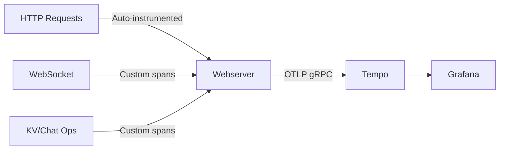

# OpenTelemetry Integration

This document describes the OpenTelemetry distributed tracing integration in the Webserver application.

## Overview

The webserver is instrumented with OpenTelemetry to export distributed traces to Grafana Tempo. This enables observability for:
- HTTP requests and responses (automatic via Cowboy instrumentation)
- WebSocket connections (custom instrumentation)
- Distributed operations: KV store operations and chat broadcasts (custom instrumentation)

## Architecture



### Components

1. **OpenTelemetry SDK** (`opentelemetry`, `opentelemetry_api`, `opentelemetry_exporter`)
   - Core tracing functionality
   - OTLP exporter for sending traces to Tempo

2. **Cowboy Instrumentation** (`opentelemetry_cowboy`)
   - Automatically creates spans for all HTTP requests
   - Captures request method, path, status code, and duration

3. **Custom Telemetry** (`lib/webserver/telemetry.ex`)
   - WebSocket event instrumentation (connect, disconnect, message)
   - Distributed operation instrumentation (KV put/get, chat broadcast)

## Configuration

### OpenTelemetry Config

Located in `config/opentelemetry.exs`:

- **Span Processor**: Batch mode for efficient export
- **Traces Exporter**: OTLP protocol
- **Endpoint**: `http://localhost:4317` (Tempo gRPC endpoint)
- **Service Name**: `webserver`
- **Compression**: gzip

### Runtime Config

Located in `config/runtime.exs`:

The OTLP endpoint can be overridden via environment variable:
```bash
export OTEL_EXPORTER_OTLP_ENDPOINT="http://tempo:4317"
```

This is useful for production deployments where Tempo runs on a different host.

## Instrumentation Details

### Automatic HTTP Tracing

All HTTP requests are automatically traced by `opentelemetry_cowboy`. Each request creates a span with:
- Span name: `{method} {route}`
- Attributes: `http.method`, `http.target`, `http.status_code`, `http.user_agent`
- Duration: Automatically calculated

### WebSocket Tracing

Custom spans are created for WebSocket events:

**Connect Event** (`websocket.connect`):
- `websocket.peer`: Client IP address
- `websocket.connection_id`: Unique connection identifier

**Disconnect Event** (`websocket.disconnect`):
- `websocket.peer`: Client IP address
- `websocket.connection_id`: Unique connection identifier
- `websocket.duration_ms`: Connection duration

**Message Event** (`websocket.message`):
- `websocket.message_type`: Message type
- `websocket.message_size`: Message size in bytes

### Distributed Operations Tracing

Custom spans for distributed operations:

**KV Put** (`kv.put`):
- `kv.key`: The key being stored
- `kv.node`: Node handling the operation
- `kv.duration_us`: Operation duration in microseconds

**KV Get** (`kv.get`):
- `kv.key`: The key being retrieved
- `kv.node`: Node handling the operation
- `kv.found`: Whether the key was found
- `kv.duration_us`: Operation duration in microseconds

**Chat Broadcast** (`chat.broadcast`):
- `chat.room`: Chat room name
- `chat.sender`: Message sender
- `chat.recipients`: Number of recipients
- `chat.duration_us`: Broadcast duration in microseconds

## Viewing Traces in Grafana

1. **Start the observability stack**:
   ```bash
   docker-compose up -d
   ```

2. **Open Grafana**: Navigate to http://localhost:3000

3. **Go to Explore**: Click the "Explore" icon in the left sidebar

4. **Select Tempo**: Choose "Tempo" from the data source dropdown

5. **Search for traces**:
   - **By Service**: Select `webserver` from the service dropdown
   - **By Operation**: Filter by span name (e.g., `GET /nodes`, `kv.put`)
   - **By Trace ID**: Enter a specific trace ID if you have one

6. **Analyze trace details**:
   - View the trace timeline showing all spans
   - Inspect span attributes and metadata
   - Analyze parent-child relationships
   - Check for errors or slow operations

## Troubleshooting

### No traces appearing in Tempo

1. **Check Tempo is running**:
   ```bash
   docker-compose ps tempo
   ```

2. **Verify OTLP endpoint is accessible**:
   ```bash
   curl http://localhost:4317
   ```

3. **Check webserver logs** for OpenTelemetry errors:
   ```bash
   # In your iex session
   Logger.configure(level: :debug)
   ```

4. **Verify configuration**:
   ```elixir
   # In iex
   Application.get_env(:opentelemetry_exporter, :otlp_endpoint)
   ```

### Traces are incomplete

- Ensure all telemetry events are being emitted from your application code
- Check that `Webserver.Telemetry.setup()` is called during application startup
- Verify span names and attributes match your expectations

### High overhead

- Adjust the batch span processor settings in `config/opentelemetry.exs`
- Consider sampling strategies for high-traffic environments
- Monitor the exporter queue size

## Future Enhancements

Potential improvements to the observability setup:

1. **Metrics**: Add OpenTelemetry metrics for request rates, error rates, and latencies
2. **Logs Correlation**: Link logs with traces using trace context
3. **Custom Sampling**: Implement intelligent sampling for high-volume endpoints
4. **Distributed Context**: Propagate trace context across cluster nodes
5. **Error Tracking**: Enhanced error span attributes with stack traces
